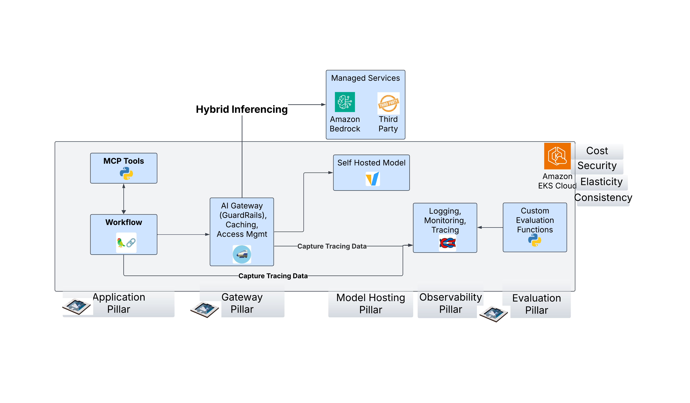
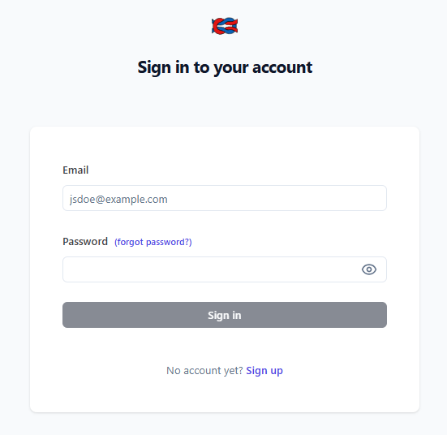
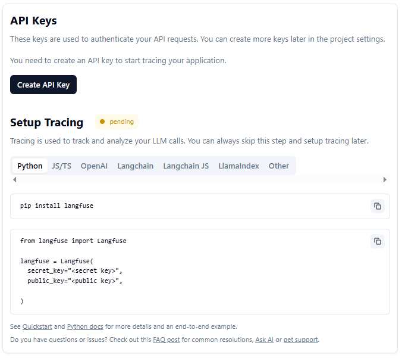
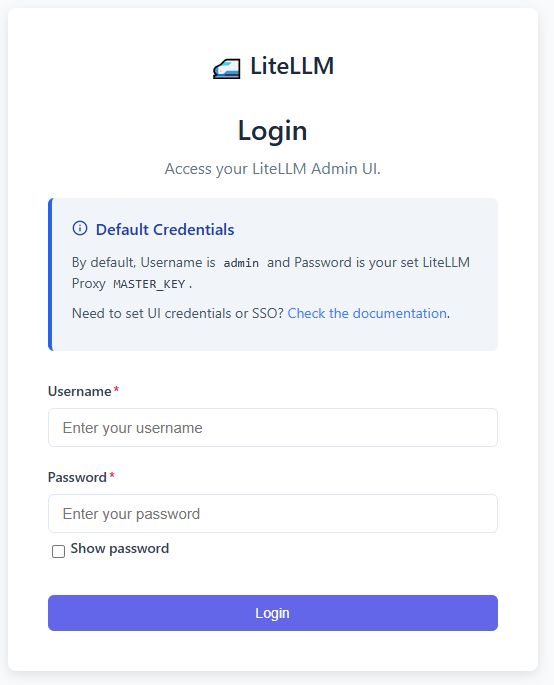
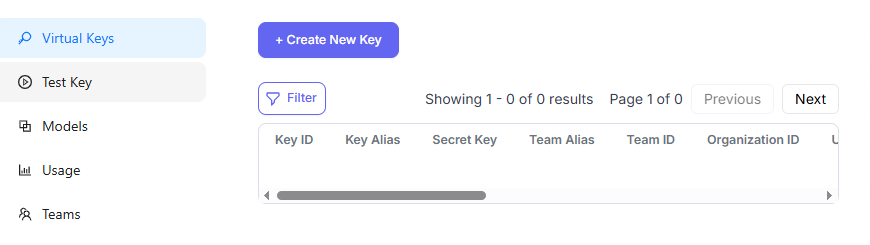
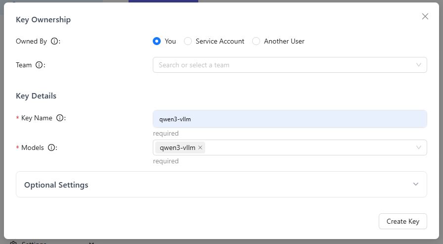
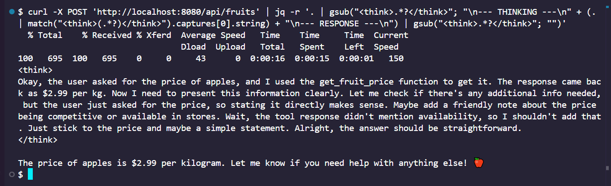
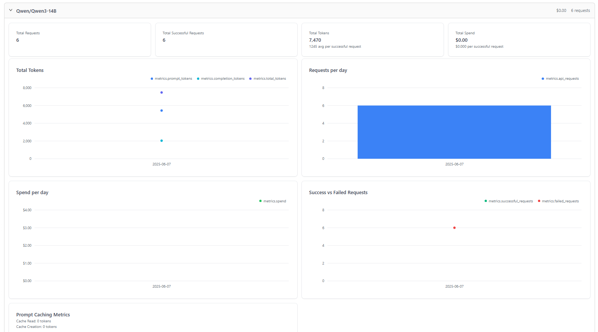
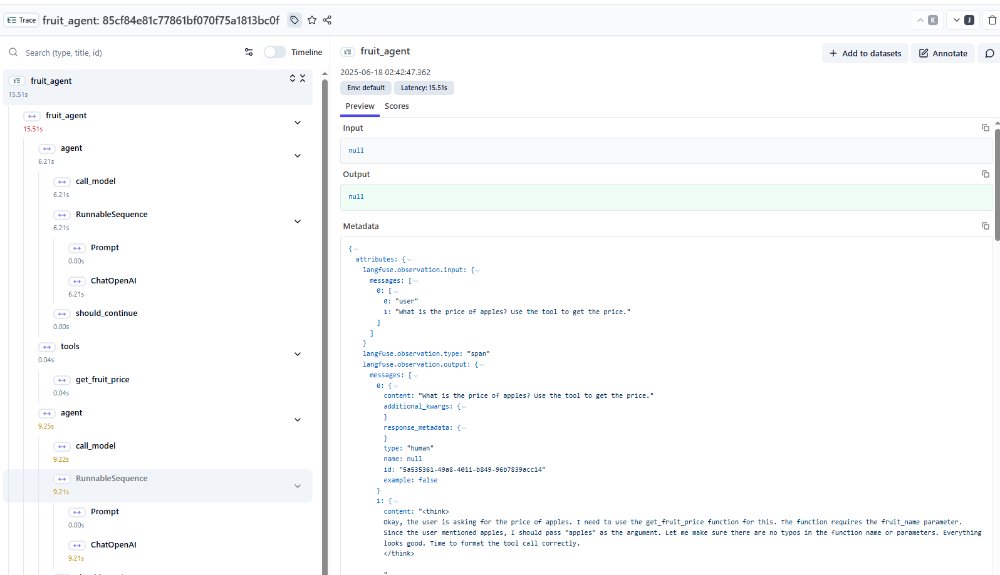

# Agentic AI Workflows on Amazon EKS with MCP

## Table of Contents
- [Introduction](#introduction)
- [Architecture](#architecture)
- [Prerequisites](#prerequisites)
- [Getting Started](#getting-started)
- [Setup Process](#setup-process)
  - [1. Cluster Setup](#1-cluster-setup)
  - [2. Model Observability (Langfuse)](#2-model-observability-langfuse)
  - [3. Model Hosting (vLLM)](#3-model-hosting-vllm)
  - [4. Model Gateway (LiteLLM)](#4-model-gateway-litellm)
  - [5. Agentic Application](#5-agentic-application)
- [Testing the Complete Workflow](#testing-the-complete-workflow)
- [Cleanup](#cleanup)
- [Security Considerations](#security-considerations)
- [Disclaimer](#disclaimer)
- [Contributing](#contributing)
- [License](#license)

---

## Introduction

This sample demonstrates how to build ** agentic AI workflows** on Amazon EKS using the Model Context Protocol (MCP). By following this guide, you'll learn how to:

🤖 **Build Intelligent AI Agents**
- Deploy LangGraph-based agents with multiple MCP tools
- Implement complex reasoning workflows with tool orchestration
- Create domain-specific AI applications (fruit store example)

🔧 **OSS Infrastructure**
- Set up model hosting with vLLM on GPU nodes
- Implement model gateway with LiteLLM for unified API access
- Deploy comprehensive observability with Langfuse tracing

⚡ **Key Features**
- **Simple MCP Tool**: Basic fruit price lookup functionality
- **Multi-Model Support**: Text and vision model capabilities
- **Complete Observability**: Full request tracing and performance monitoring
- **Production Security**: Virtual keys, access control, and secure secrets management

**What You'll Build:**
A complete agentic AI system that demonstrates MCP integration with a simple fruit pricing tool, showcasing how agents can use external tools to provide accurate responses.

---

## Architecture



Read this [blog](https://medium.com/@masood.faisal/building-genai-solutions-on-amazon-eks-f7e52ad1edcc) for a deep dive on this architecture. 

### Component Overview

🏗️ **Infrastructure Layer**
- **EKS Auto Mode**: Simplified cluster management with Graviton and GPU node poolsn

🤖 **Model Layer**
- **vLLM Servers**: High-performance model serving for Qwen text and vision models
- **LiteLLM Gateway**: Unified API interface with virtual key management

📊 **Observability Layer**
- **Langfuse**: Complete request tracing, performance monitoring, and usage analytics

🔧 **Application Layer**
- **Agentic API**: LangGraph-based agent with simple MCP tool integration
- **MCP Tool**: Basic fruit pricing functionality for demonstration

---

## Prerequisites

### 🛠️ Required Tools
- [AWS CLI](https://docs.aws.amazon.com/cli/latest/userguide/cli-chap-getting-started.html)
- [kubectl](https://kubernetes.io/docs/tasks/tools/)
- [Terraform](https://developer.hashicorp.com/terraform/tutorials/aws-get-started/install-cli)

### 🔑 Required Credentials
- **AWS Account**: With appropriate permissions for EKS, EC2, and VPC
- **HuggingFace Token**: [Create a fine-grained access token](https://huggingface.co/settings/tokens) for model downloads

> **Important**: This demo uses GPU instances for model hosting. Ensure your AWS account has sufficient GPU quota in your chosen region.

---

## Getting Started

Clone the repository:
```bash
git clone https://github.com/aws-samples/samples-genai-eks.git
cd samples-genai-eks
```

---

## Setup Process

### 1. Cluster Setup

Deploy the EKS cluster with Auto Mode configuration:

```bash
cd iac/terraform
chmod +x setup.sh
./setup.sh
```

### 2. Setup Storage Classes and Node Pools

Configure Graviton and GPU node pools, removing the default general-purpose nodes:

```bash
cd ../auto-mode-config
chmod +x setup.sh
./setup.sh
```

> **Note**: From this point forward, Graviton nodes are the default. Ensure any additional non-GPU workloads are ARM64 compatible.

### 3. Model Observability (Langfuse)

Deploy Langfuse for comprehensive AI workflow observability:

```bash
cd ../../platform-components/model-observability
chmod +x setup.sh
./setup.sh
```

**Access Langfuse Dashboard:**
```bash
# Get the ALB hostname
kubectl get ingress langfuse-web-ingress-alb -n genai -o jsonpath='{.status.loadBalancer.ingress[0].hostname}'
```



**Setup Langfuse Project:**
1. Open your browser to the ALB hostname (may take 5-10 minutes for ALB to be ready)
2. Create an account and sign in
3. Create organization named **"test"**
4. Create project named **"demo"** within the organization
5. Navigate to **"Tracing"** menu and generate API keys



**Export the API keys:**
```bash
export LANGFUSE_PUBLIC_KEY=<your-langfuse-public-key>
export LANGFUSE_SECRET_KEY=<your-langfuse-secret-key>
```

### 4. Model Hosting (vLLM)

Deploy high-performance model servers using vLLM:

```bash
cd ../model-hosting
chmod +x setup.sh
```

**Provide your HuggingFace token:**

**Option 1: Pass token as argument**
```bash
./setup.sh <your_hugging_face_token>
```

**Option 2: Interactive prompt**
```bash
./setup.sh
# You'll be prompted to enter your token
```

**Wait for model deployment:**
```bash
# Monitor pod status
kubectl get pods -n genai -w
```

> **Important**: Wait for both vLLM pods to be fully running before proceeding. Model downloads can take 10-15 minutes.

### 5. Model Gateway (LiteLLM)

Deploy LiteLLM as a unified model gateway:

```bash
cd ../model-gateway
chmod +x setup.sh
./setup.sh
```

**Access LiteLLM Admin Panel:**
```bash
# Get ALB hostname
kubectl get ingress litellm-ingress-alb -n genai -o jsonpath='{.status.loadBalancer.ingress[0].hostname}'
```

```bash
# Get admin credentials
LITELLM_PASSWORD=$(kubectl get secret litellm-secrets -n genai -o jsonpath='{.data.master-key}' | base64 -d)
echo "Username: admin"
echo "Password: $LITELLM_PASSWORD"
```



**Create Virtual Keys:**
1. Navigate to **"Virtual Keys"** in the sidebar
  
2. Create virtual key for **"qwen3-vllm"** (text model)
  
3. Create virtual key for **"vllm-server-qwen-vision"** (vision model)

**Export the virtual keys:**
```bash
export QWEN_TEXT_MODEL_KEY=<virtual-key-for-qwen3-vllm>
export QWEN_VISION_MODEL_KEY=<virtual-key-for-vision-model>
```

### 6. Agentic Application

Deploy the intelligent fruit store agent with MCP tools:

```bash
cd ../../agentic-flow-with-mcp
chmod +x setup.sh
```

**Deploy with text model (default):**
```bash
./setup.sh
```

**Deploy with vision capabilities:**
```bash
./setup.sh --vision
```

---

## **MCP Tool Overview**

The simplified MCP server provides a single tool for demonstration:

### **Available MCP Tool:**
- **`get_fruit_price(fruit_name: str)`** - Returns price for any fruit
- **Response Format**: "Price for {fruit_name} is $2.99 per kg"
- **Purpose**: Demonstrates basic MCP integration and tool calling patterns

### **How It Works:**
1. **User sends request** → Agent receives query about fruit pricing
2. **Agent calls MCP tool** → Uses `get_fruit_price()` with fruit name parameter  
3. **MCP tool responds** → Returns hardcoded $2.99/kg price for any fruit
4. **Agent responds** → Provides formatted response to user

This simple implementation focuses on demonstrating the core MCP concepts without complex business logic.

---

## Testing the Complete Workflow

Now let's test the complete agentic AI workflow with comprehensive monitoring:

### Step 1: Port Forward Setup

```bash
# Port forward to access the API
kubectl port-forward service/agentic-app 8080:8080 -n genai
```

### Step 2: Send Test Query

Open a new terminal and send a simple query:

```bash
curl -X POST 'http://localhost:8080/api/fruits'
```

**What Happens Behind the Scenes:**
1. The agent receives a hardcoded query: "What is the price of apples? Use the tool to get the price."
2. The agent calls the MCP tool: `get_fruit_price(fruit_name="apples")`
3. The MCP tool responds: "Price for apples is $2.99 per kg"
4. The agent formats and returns the response



### Step 3: Analyze the Response

**Expected Response Format:**
The agent should provide a response like:
```
"Based on the pricing tool, the price for apples is $2.99 per kg."
```

**What This Demonstrates:**
- ✅ **MCP Tool Integration** - Agent successfully calls external MCP tool
- ✅ **Tool Parameter Passing** - Fruit name passed to `get_fruit_price()`
- ✅ **Response Processing** - Agent formats tool response for user
- ✅ **End-to-End Workflow** - Complete request → tool call → response cycle

### Step 4: Monitor LiteLLM Gateway

Check the model gateway metrics:

```bash
# Get LiteLLM dashboard URL
kubectl get ingress litellm-ingress-alb -n genai -o jsonpath='{.status.loadBalancer.ingress[0].hostname}'
```

Navigate to the LiteLLM admin panel and check:
- **Request metrics** in the dashboard
- **Virtual key usage** statistics
- **Model performance** data



### Step 5: Examine Langfuse Tracing

Access the Langfuse dashboard:

```bash
# Get Langfuse dashboard URL
kubectl get ingress langfuse-web-ingress-alb -n genai -o jsonpath='{.status.loadBalancer.ingress[0].hostname}'
```

In the Langfuse dashboard, examine:
- **Complete request trace** showing agent reasoning
- **MCP tool calls** and their responses
- **Performance metrics** and token usage
- **Cost analysis** for the request



**Interactive API Documentation:**
Access comprehensive API docs at: `http://localhost:8080/docs`

---

## Cleanup

Remove all deployed resources:

```bash
# Clean up in reverse order
kubectl delete -f deployments/

cd ../platform-components/model-gateway
kubectl delete -f litellm-deployment.yaml
kubectl delete -f litellm-ingress.yaml

cd ../model-hosting
kubectl delete -f vllm-qwen-deployment.yaml
kubectl delete -f vllm-qwen-vision-deployment.yaml

cd ../model-observability
kubectl delete -f langfuse-deployment.yaml
kubectl delete -f langfuse-ingress.yaml

# Destroy cluster infrastructure
cd ../../iac/terraform
terraform destroy --auto-approve
```

---

## Security Considerations

Our code is continuously scanned using [Checkov](https://www.checkov.io/5.Policy%20Index/kubernetes.html) and [Bandit](https://bandit.readthedocs.io/en/latest/) for security vulnerabilities. The following security considerations are documented for transparency:

### Checkov Security Scans

|Checks	|Details	|Reasons	|
|---	|---	|---	|
|CKV_TF_1	|Ensure Terraform module sources use a commit hash	|For easy experimentation, we set version of module, instead of setting a commit hash. Consider implementing a commit hash in a production cluster. [Read more on why we need to set commit hash for modules here.](https://medium.com/boostsecurity/erosion-of-trust-unmasking-supply-chain-vulnerabilities-in-the-terraform-registry-2af48a7eb2)	|
|CKV_SECRET_6 |Base64 High Entropy String | This check flags Base64-encoded, high-entropy strings, which are typical for Kubernetes secrets (all values under the data field must be Base64-encoded). While this is a best practice for storing sensitive data, it results in expected false positives during scans. We acknowledge this is required for Kubernetes, and secrets are managed securely outside of version control. |
|CKV2_K8S_6	|Minimize the admission of pods which lack an associated NetworkPolicy	|All Pod to Pod communication is allowed by default for easy experimentation in this project. Amazon VPC CNI now supports [Kubernetes Network Policies](https://aws.amazon.com/blogs/containers/amazon-vpc-cni-now-supports-kubernetes-network-policies/) to secure network traffic in kubernetes clusters	|
|CKV_K8S_8	|Liveness Probe Should be Configured	|For easy experimentation, no health checks is to be performed against the container to determine whether it is alive or not. Consider implementing [health checks](https://kubernetes.io/docs/tasks/configure-pod-container/configure-liveness-readiness-startup-probes/) in a production cluster.	|
|CKV_K8S_9	|Readiness Probe Should be Configured	|For easy experimentation, no health checks is to be performed against the container to determine whether it is alive or not. Consider implementing health checks in a production cluster.	|
|CKV_K8S_22	|Use read-only filesystem for containers where possible	|We've made an exception for the workloads that requires are Read/Write file system. [Configure your images with read-only root file system](https://docs.aws.amazon.com/eks/latest/best-practices/pod-security.html#_configure_your_images_with_read_only_root_file_system)	|
|CKV_K8S_23	|Minimize the admission of root containers	|This project uses default root container configurations for demonstration purposes. While this doesn't follow security best practices, it ensures compatibility with demo images. For production, configure runAsNonRoot: true and follow [guidance](https://docs.docker.com/engine/reference/builder/#user) on building images with specified user ID.  	|
|CKV_K8S_35	|Prefer using secrets as files over secrets as environment variables	|For demonstration purposes, some secrets are passed as environment variables for simplicity. In production environments, consider mounting secrets as files using Kubernetes secret volumes instead of environment variables to reduce the risk of accidental exposure. [Learn more about secret best practices](https://kubernetes.io/docs/concepts/configuration/secret/#best-practices).	|
|CKV_K8S_37	|Minimize the admission of containers with capabilities assigned	|For easy experimentation, we've made exception for the workloads that requires added capability. For production purposes, we recommend [capabilities field](https://docs.aws.amazon.com/eks/latest/best-practices/pod-security.html#_linux_capabilities) that allows granting certain privileges to a process without granting all the privileges of the root user.  	|
|CKV_K8S_40	|Containers should run as a high UID to avoid host conflict	|We've used publicly available container images in this project for customers' easy access. For test purposes, the container images user id are left intact. See [how to define UID](https://kubernetes.io/docs/tasks/configure-pod-container/security-context/#set-the-security-context-for-a-pod).	|

### Bandit Security Scans

|Checks	|Details	|Reasons	|
|---	|---	|---	|
|B104	|Possible binding to all interfaces	|Applications bind to `0.0.0.0` to enable proper Kubernetes service-to-service communication and port-forwarding access. In containerized environments, this is necessary for the service mesh to route traffic correctly. Network security is provided by Kubernetes NetworkPolicies, service isolation, and proper ingress controls rather than host binding restrictions.	|

---

## Disclaimer

⚠️ **This repository is intended for demonstration and learning purposes only.**
It is **not** intended for production use. The code provided here is for educational purposes and should not be used in a live environment without proper testing, validation, and modifications.

Use at your own risk. The authors are not responsible for any issues, damages, or losses that may result from using this code in production.

## Contributing

Contributions welcome! Please read our [Contributing Guidelines](CONTRIBUTING.md) and [Code of Conduct](CODE_OF_CONDUCT.md).

## License

This project is licensed under the MIT License - see [LICENSE](LICENSE) file.
